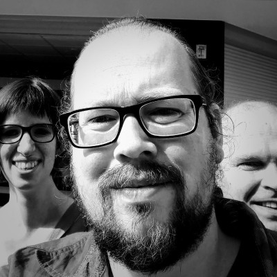

# Joost Vermeulen
Software Engineer

  <i class="fas fa-envelope"></i>&nbsp;<a href="mailto:cv@jover.net">cv@jover.net</a> |
  <i class="fab fa-github"></i>&nbsp;<a href="https://github.com/joverthegrey">joverthegrey</a> |
  <i class="fab fa-linkedin"></i>&nbsp;<a href="https://linkedin.com/in/joost-vermeulen-0a09011">Joost</a> |
  <i class="fas fa-key"></i>&nbsp;<a href="https://keybase.io/jover/pgp_keys.asc?fingerprint=265729857ba0971e69a7023d8ce50282d0e5148a">8CE5 0282 D0E5 148A</a>

## Persoonlijk

- Leeftijd: 40
- Woonplaats: Nijmegen
- Rijbewijs: geen
- Nationaliteit: Nederlandse

## Opleidingen

`2001-2008`
*Radboud Universiteit Nijmegen*

- Informatica 
- Afgestudeerd: - 

`1997-2001`
*Avans Hogeschool 's-Hertogenbosch*

- Hogere Informatica (Telematica) 
- Afgestudeerd: 2001

## Cursussen / trainingen
`2014` *Scouting Nederland*  
Gekwalificeerd regio-organisator

`2014` *Zend*  
Zend certified Engineer (<a href="https://www.zend-zce.com/en/yellow-pages/ZEND024346">ZEND024346</a>) 

`2010` *Scouting Nederland*  
Gekwalificeerd Teamleider Scouts

`2009` *Scouting Nederland*  
Gilwell (buitenland)

`2009` *SpringSource*  
Tomcat Expert Seminar

`2000` *KNBRD*  
Zweminstructeur A

## Technieken / tooling

|   |   |   |
|:---|:---:|:---|
| frontend | : |Javascript, VueJS, jQuery, Ajax, CSS3, html5, ExtJS |
| backend  | : |PHP, Laravel, Lumen, Composer, Packagist, Symfony, Doctrine 1, Zend Framework, Java, Groovy, Grails, Perl/Tk, WordPress plugins, Docker, PHPUnit, JUnit |
| databases | : |MySQL, MariaDB, PostgreSQL |
| overig | : |Markdown, LaTeX, bash, zsh, Apache, NGINX |
| tooling | : |PhpStorm, IntelliJ, Datagrip, Vim, Eclipse, NetBeans, Laravel Valet, Homestead, Vagrant|

## Werkervaring
### InterNLnet
`2020 - now`
*PHP Developer*  

*Zonnet Forward API*  
Voor Zonnet heb ik een RESTful API gemaakt, zodat het klantenpaneel van Totaalnet, Zonnet forwards kan aanmaken, aanpassen of verwijderen. Later is de API uitgebreid met de mogelijkheid om hetzelfde te doen voor accounts, deze functionaliteit is voornamelijk gebouwd mbt spam afhandeling.

Technieken: REST, Lumen, PHP 7+, LDAP

&nbsp;

*Zonnet Select*  
Een console applicatie gemaakt met Symfony command, waarmee het mogelijk is om verschillende klantgroepen te mailen. De mailings kunnen verstuurd worden door ze rechtstreeks in de Maildir van de klant te plaatsen of via SMTP / Mailgun naar de forwards te mailen. Verder kan de applicatie mailbatches genereren aan de hand van een mail template.

Technieken: PHP 7+, Symfony Command, Eloquent, Maildir, LDAP, PostgreSQL, Mailgun

### T-Mobile
`2018 - 2020`
*PHP Developer / Scrum master*

*Charon*  
Als onderdeel van het beheer van de Tele2 emailboxen, heb ik een "inactieve mailbox sunsetting" applicatie ontwikkeld en gebouwd. Deze applicatie kijkt via Elastic Search welke klanten inactief zijn en indien deze ook aan andere variablen voldoen, worden ze op een sunsetting traject gezet, uiteindelijk gearchiveerd en opgeruimd. 

Technieken: PHP 7+, Laravel, Elastic Search, LDAP, Maildir, Mdbox, VueJS

&nbsp;

*Zonnet Scripts*  
Voor de verkoop van InterNLnet moest informatie van onze platformen worden verzameld, aantal gebruikers, aantal logins, login periode (daily, bi-daily, weekly, bi-weekly etc). De scripts genereerden de statestieken via Elastic Search, rechtstreekse logging, LDAP en de maildirs van de gebruikers zelf.

Technieken: PHP 7+, Elastic Search, Eloquent, Composer, Symfony, LDAP, Maildir, PostgreSQL

### Tele2
`2010 - 2018`
*PHP Developer / Scrum master*  
Na InterNLnet was overgenomen door Tele2, kwamen er nieuwe systemen, projecten en migraties bij. 

&nbsp;

*HDB Middleware*  
HDB Middleware is een Laravel Applicatie die ontwikkeld is om de customers / billlines van twee billingsystemen met elkaar te vergelijken en deze stromen met elkaar samen te voegen. Dit zodat we van billingsysteem konden veranderen, zonder dat de upstream (finance) hiervan last/weet had.

Technieken: PHP 7+, Homestead, Laravel, Symfony, xmlrpc, VueJS.

&nbsp;

*AbuseIO* (<a href="https://abuse.io">AbuseIO</a>)  
AbuseIO verdeelt abuse meldingen van de ISP zijn IP-space over zijn klanten / contacten. Klanten kunnen dan hun abuse melding verder afhandelen via het ingebouwde ticket systeem.

Technieken: PHP 7+, Laravel, Docker, Vagrant 

&nbsp;

*Vuurwerk migratie*  
Voor de migratie van het Vuurwerk hosting platform, naar een nieuw hosting platform (PBA/POA) hebben we verschillende scripts en bijbehorende applicaties gemaakt.

*Scripts*: php scripts waarmee we klanten in fases konden overzetten naar POA  
*Spegill*: Webapplicatie die screenshots maakte voor en na de migratie en deze controleerde / voorsorteerde voor het servicedesk ter controle.  
*Heimdall*: Webapplicatie die de progressie / logging van de migratie van de klanten batches kon laten zien en terug kon rollen indien nodig. 

Technieken: PHP 5.4, xmlrpc, Java, Groovy, Grails, PhantomJS, Selenium WebDriver, nodejs

&nbsp;

*MailDB*  
Een Grails applicatie om onze mailaliases en mailadressen voor verschillende klantsystemen uniform te beheren. 

Technieken: Java, Grails, Groovy, MySQL

&nbsp;

*anbiknr.nl*  
In 2013 werd een belastingwet aangenomen, waarin voor ANBI stichtingen word afgedwongen, dat ze hun financiële jaarverslagen online beschikbaar maken. De Konferentie Nederlandse Religeuzen had ons gevraagd een oplossing te leveren. Ik heb toen een static site generator geschreven, die door ons beheerd en gehost werd (het beheer is later naar de KNR zelf gegaan).

Technieken: Java, Grails, Groovy, Tomcat

&nbsp;

*Athena / Yoda*  
Politiek technisch moesten we Yoda van naam veranderen en werden er nieuwe koppelingen gemaakt naar oa Parallels Operations Automation (POA) en Parallels Business Automation (PBA) (tegenwoordig allebei onderdeel van CloudBlue).

Technieken: PHP 5.3, xmlrpc, Zend Framework 1, PostgreSQL

### InterNLnet
`2009-2010`
*PHP Developer*  

Oorspronkelijk aangenomen als Java ontwikkelaar voor SPIN, een vervanging voor het cms van InterNLnet HDB, bleek al gauw dat de requirements wijzigden en werd er gekeken naar het bouwen van een eigen cms mbv PHP. Dit werd Yoda.

&nbsp;

*Yoda*  
Yoda is een cms met oa een eigen ontworpen billing engine en koppelingen naar verschillende provisionings systemen, in het begin legacy systemen Vuurwerk en Bix, later kwamen hier ook nieuwere hosting platformen bij.

Technieken: PHP 5.3, Doctrine 1, Zend Framework 1, ExtJs, PostgreSQL

### First8
`2006-2009`
*Bijbaan, Java ontwikkelaar, systeembeheerder*

First8 maakt webapplicaties voor klanten in Java (en andere JVM smaakjes), ik ben hier begonnen met een bijbaantje en later doorgegroeid naar fulltime Java ontwikkelaar. Naast custom oplossingen voor grote klanten leverden ze ook simpele sites. Ik heb hier aan verscheidende projecten meegewerkt.

&nbsp;

*Verkoopgoed.nl*  
Een veilingsite waarbij de opbrengst van veilingen (deels) wordt geschonken aan een goed doel gekozen door de verkoper. In een team met drie andere collega's hebben we functionaliteit van het frontoffice en het gehele backoffice gemaakt.

Technieken: Groovy, Grails, Tomcat, PostgreSQL

&nbsp;

*Conclusion Implementation Intranet*  
Het Conclusion Implementation Intranet is een volledig door First8 opgezet intranet / CRM. Het bevat alle producten, projecten, klanten en medewerkers van CI. De eerste variant was een groots opgezette MMbase webapplicatie. Echter na een tijd werden de requirements te complex voor MMBase en hebben we hem opnieuw opgezet in Grails.

Technieken: Groovy, Grails, Jetty, Tomcat, MMBase, PostgreSQL

&nbsp;

*Tripledeal*  
Tripledeal, nu Docdata Payments, is een escrowservice met koppelingen naar onder andere creditcardbetalingen en IDeal. In de tijd dat ik aan het project hebt gewerkt, heb ik me vooral beziggehouden met het oplossen van bugs in het backoffice.

Technieken: Java, jsp, jsf, Tomcat, PostgreSQL

&nbsp;

*Site in a box (Siab)*  
Siab was een modulair framework van First8, het framework richt zich op niet al te complexe websites. Denk hierbij aan een simpele bedrijfssite met maar een paar pagina's en producten. Ik heb hiermee verschillende sites opgezet en uitgebreid qua functionaliteit. Siab maakt vooral gebruik van MMbase en jsp, later werd dit Grails

Technieken: MMBase, jsp, Java, Tomcat, Grails, Jetty, PostgreSQL

### Tunix
`2000-2008`
*Afstuderen, bijbaan, ontwikkelaar*  
Tunix Digital Security levert security oplossingen aan zijn klanten, een van deze oplossingen is de Tunix Firewall.
Mijn afstudeerstage bestond uit het integreren van IPSec op de toenmalige Tunix firewalls, deze draaiden op BSD/OS en hiervoor heb ik onder andere de TUN kernel module van OpenBSD naar BSD/OS geport en een IKE daemon aangepast / gemodificeerd.

Als bijbaantje heb ik hier ook nog interne tooling gemaakt met Perl/Tk.

Technieken: BSD, C/C++, IPSec/IKE, Perl/Tk

## Vrijwilligerswerk
### Scouting Nederland
`2019 - now`
*Team Spel, Regiospelen*  
Met Team Spel maken we thema's voor de landelijke activiteiten, ook maken we voorbeeld spelen in die thema's. Team Regiospelen richt zich voornamelijk op de regionale dagen en levert thematische spelen aan voor de scouting regio's.

### AbuseHub   (<a href="https://www.abuseinformationexchange.nl">abuse information exchange</a>)
`2018 - now`
*Technical boardmember*  
Ook hier ben ik via het werk binnengerold, AbuseHub is het systeem dat abuse streams aanbiedt aan de leden van Abuse Information Exchange, deze streams bevatten de abuse meldingen voor de specifieke ipspace van het lid. Als technical board stellen we de roadmap samen, sturen we de ontwikkelaar aan en testen de nieuwe opgeleverde functionaliteit.

### AbuseIO   (<a href="https://abuse.io">AbuseIO</a>)
`2015 - now`
*Core developer*  
Vanuit Tele2 zochten we naar een abuse handling pakket, we vonden het Open Source pakket AbuseIO. Aangezien we wat specifieke wijzigingen wilden, zijn we gaan meehelpen met ontwikkelen. Naast een paar uur per week vanuit het werk, zijn een collega en ik er blijven hangen als core en lead developers.

### Scouting RegioZON
`2012 - now`
*Regio-organisator Scouts*  
Samen met het rest van het team organiseren we evenementen (zoals regionale wedstrijden, kampen, tochten en andere activiteiten) voor de scouts van RegioZON. Normaal zijn dit evenementen voor +- 250 scouts en 50 leiding. 

### Valkhof Affaire /    Valkof Festival
`2006 - now`
*Vrijwilliger*  
Vrijwilliger op het festival (kassa / informatie)

### Studentenvakbond AKKU
`2005 - 2006`
*Penningmeester*  
AKKU is een levende vakbond, die de rechten behartigt voor de studenten in Nijmegen (HAN en RU). Naast langere tijd als actief lid, zat ik het bestuur van 2005 tot 2006 als penningmeester. 

### Studievereniging Thalia
`2003 - 2005`
*Vicevoorzitter en Secretaris*  
Thalia is de studieverenging voor Informatica studenten, als secretaris en vicevoorzitter was ik de contactpersoon voor onze zusterverenigingen en leden.  

### Scouting Karel de Stoute
`1999 - now`
*Bestuur / Teamleider / Leiding*  
Scouting Karel de Stoute is een scoutinggroep met +- 200 leden, naast teamleider en leiding geweest te zijn bij verschillende speltakken (Esta's, Welpen en Scouts), ben ik hier ook nog een paar jaar groepssecretaris geweest en ging ik onder andere over het ledenbeheer.

### Nijmeegse Reddings Brigade
`1998 - 2003`
*Zweminstructeur*  
Als zweminstructeur heb ik aan verschillende leeftijden reddend zwemmen les gegeven.

## Activiteiten en interesses
- Dnd
- Fotografie
- Geocaching
- Open Source
- Scouting

<!-- ### Footer

Last updated: 5 Nov 2020 18:05-->

